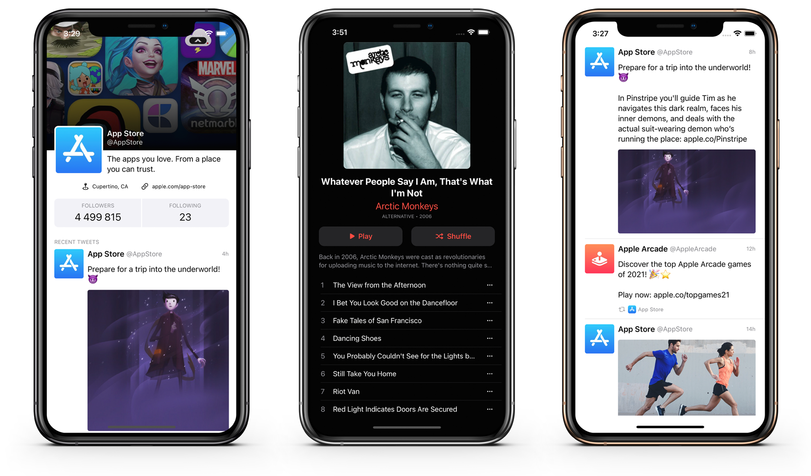

# Coding Auto Layout by Example

Repository with starting and finished projects for [Coding Auto Layout by Example](https://marpies.com/coding-auto-layout-by-example/), a series about building iOS user interfaces using Auto Layout programatically (Swift).

The series is aimed towards beginners trying to acquire the skill of building UI purely using code. It covers the basics of Auto Layout without going into a great detail, just enough to get you started on your journey. Multiple guided examples from simple to advanced are provided with (hopefully) enough explanation to teach you the *what*, *how* and *why* of Auto Layout.

## Table of Contents

1. [Intro](https://marpies.com/coding-auto-layout-by-example/)
1. [Basics, Part One](https://marpies.com/coding-auto-layout/basics-part-1/)
1. [Basics, Part Two](https://marpies.com/coding-auto-layout/basics-part-2/)
1. [Xcode Setup](https://marpies.com/coding-auto-layout/xcode-setup/)
1. [Sign Up Screen](https://marpies.com/coding-auto-layout/sign-up-screen/)
1. [Stack Views](https://marpies.com/coding-auto-layout/stack-views/)
1. [Custom UIAlert](https://marpies.com/coding-auto-layout/custom-uialert/)
1. [Players Profile](https://marpies.com/coding-auto-layout/player-profiles/)
1. [Twitter Timeline](https://marpies.com/coding-auto-layout/twitter-timeline/)
1. [Twitter Profile](https://marpies.com/coding-auto-layout/twitter-profile/)
1. [Music Album](https://marpies.com/coding-auto-layout/music-album/)

## Feedback

Should you find any issues with the code presented in the series, unclear information or want to discuss some of the topics further, please do <a href="https://marpies.com/contact" target="_blank">get in touch</a>!